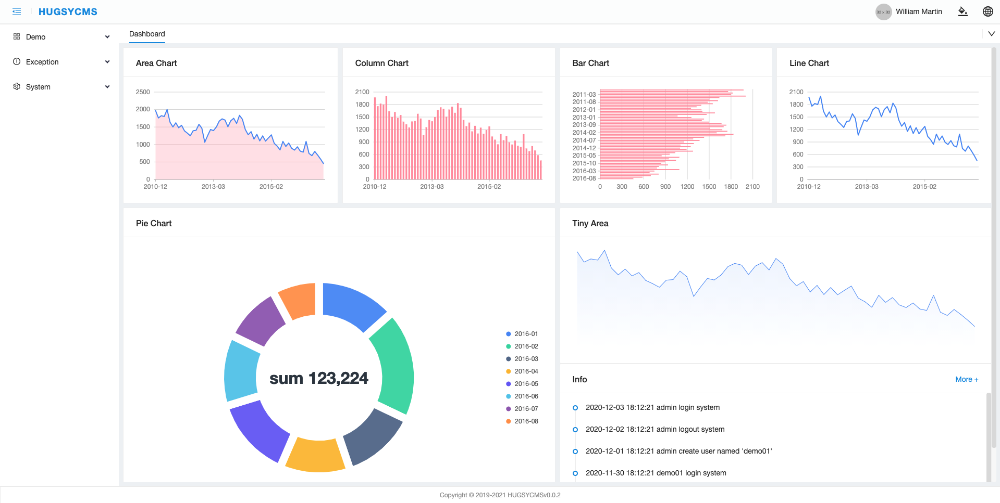
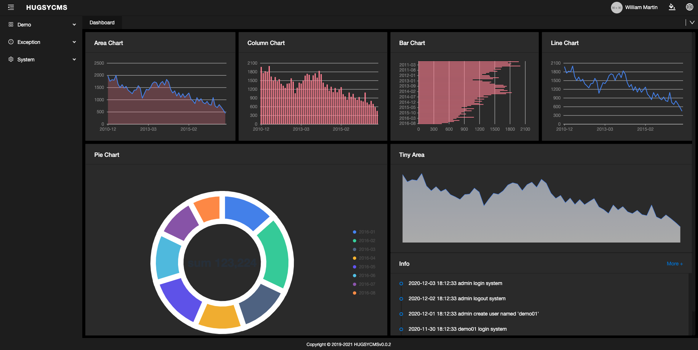
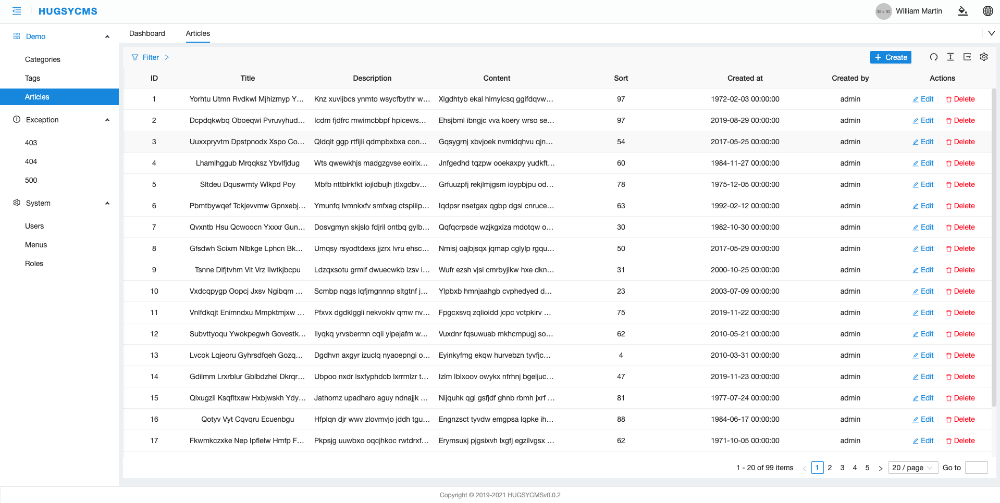
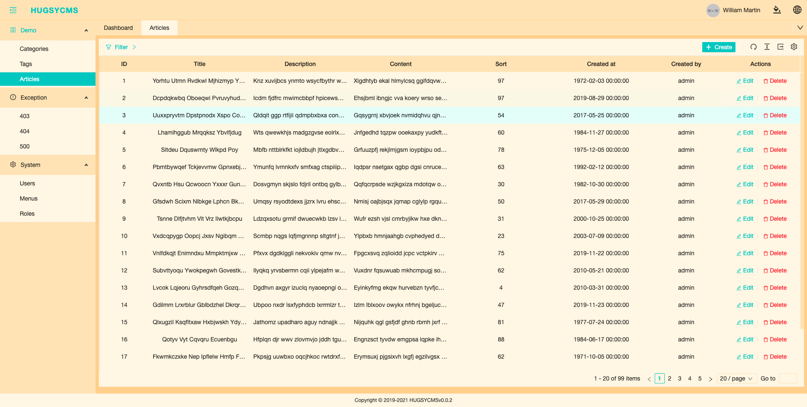
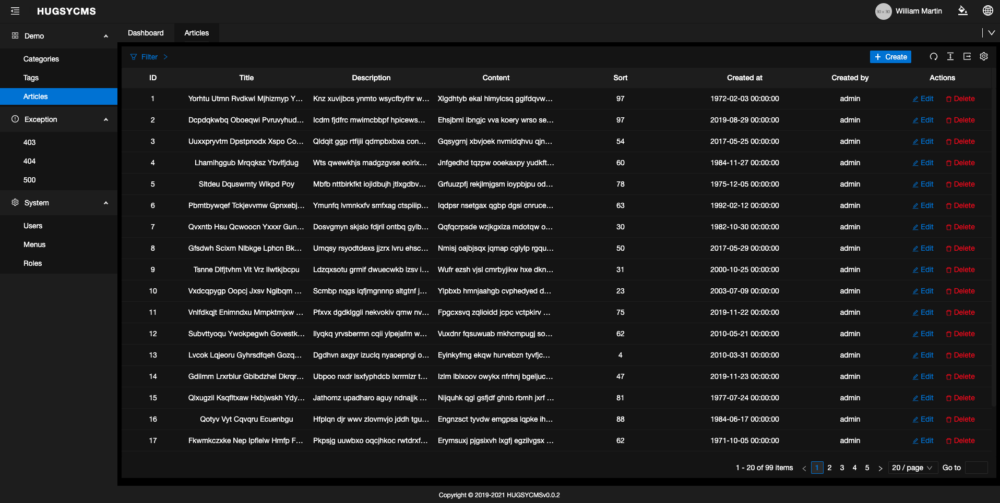

<h1 align="center">Hugsy CMS</h1>

An out-of-box UI solution for enterprise applications as a React boilerplate.

- English | [简体中文](./README.zh-CN.md)
- Home Page: https://github.com/hugsycms/hugsycms

## View

## Demo

- [View Demo](http://106.13.45.226:5000)

## Features

- :bulb: **TypeScript**: A language for application-scale JavaScript
- :art: **Theming**: Customizable theme with simple config
- :globe_with_meridians: **International**: Built-in i18n solution
- :1234: **Mock development**: Easy to use mock development solution
- :white_check_mark: **UI Test**: Fly safely with unit and e2e tests

## Browsers support

Not support IE, safari and google browser is the best experience.

|   Edge |  Firefox |  Chrome |  Safari |  Opera |
| --- | --- | --- | --- | --- |
| Edge | last 2 versions | last 2 versions | last 2 versions | last 2 versions |

## Contributing

Any type of contribution is welcome .

- feat: feature
- fix: fix bug
- docs: update documentation
- style: code style
- refactor: refactor code
- test: unit test
- chore: auxiliary tool changes

## README TODO

- [ ] Introduction of theme
- [ ] Introduction of i18n
- [ ] Introduction of RBAC
- [ ] Introduction of router
- [ ] Introduction of router custom form component
- [ ] Introduction of router advanced configuration
- [ ] Introduction of router unit test
- [ ] Introduction of router automatic deployment
