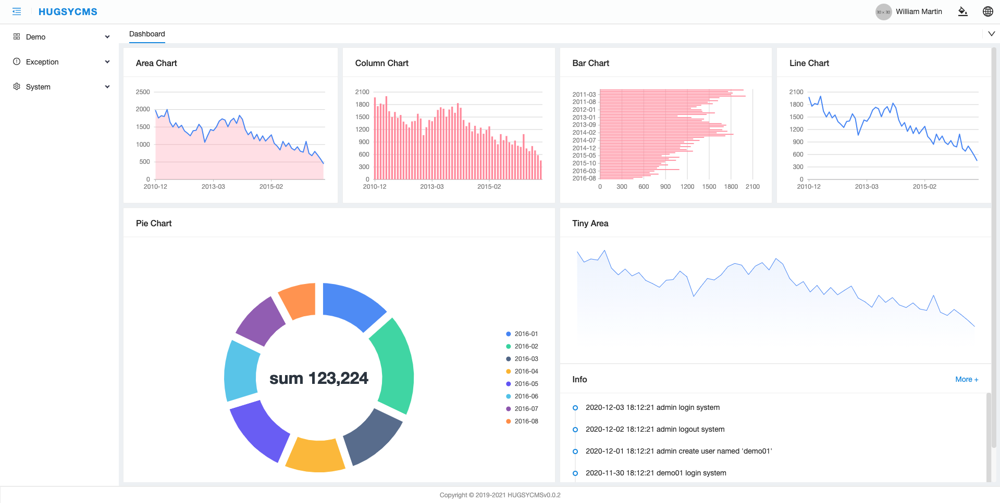
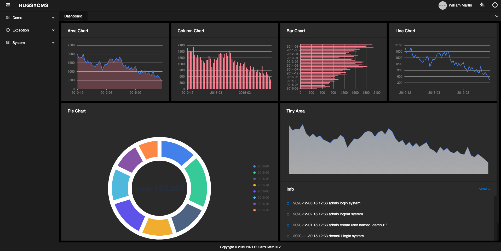
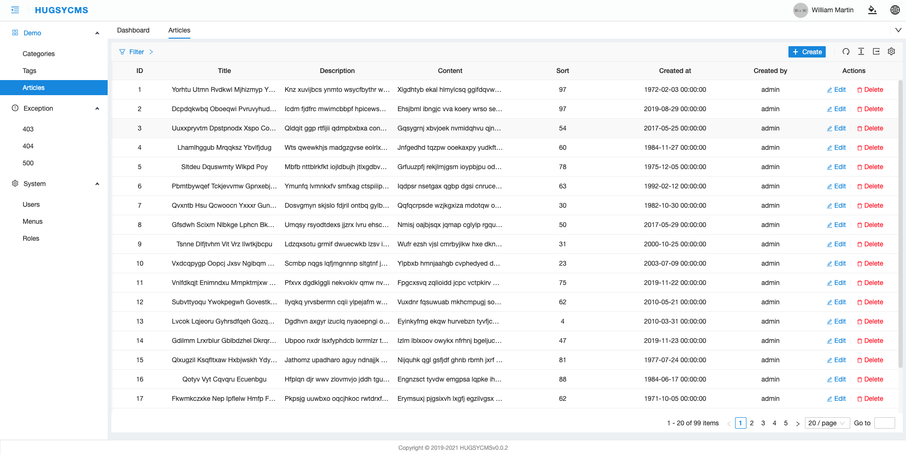
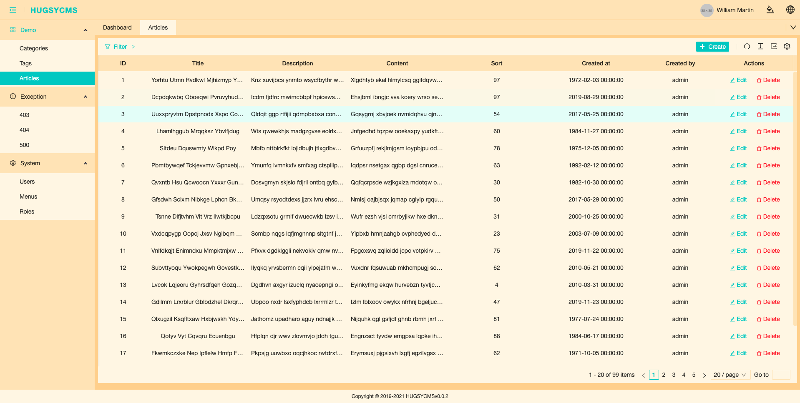
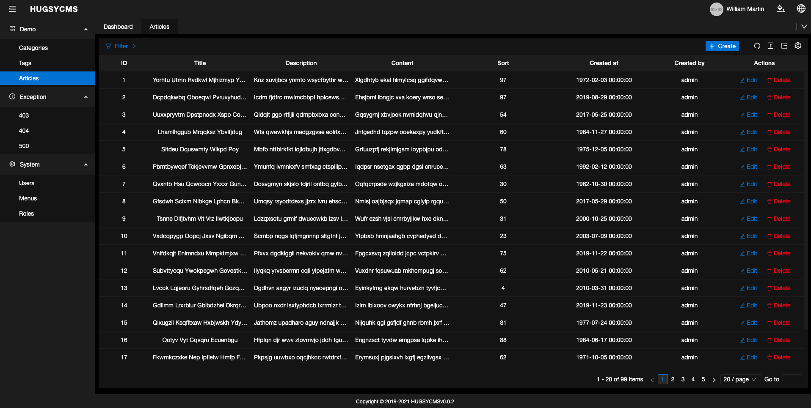

<h1 align="center">Hugsy CMS</h1>

<div align="center">

一款开箱即用，基于 React + Antd 集成的管理后端

</div>

- [English](./README.md) | 简体中文
- Home Page: https://github.com/hugsycms/hugsycms

## View








## Demo

- [View Demo](http://106.13.45.226:5000)

## 功能

- 💡 **TypeScript**: 采用 TypeScript 开发
- 🎨 **Theming**: 自定义多套主题
- 🌐 **International**: 提供国际化支持
- 🔢 **Mock development**: 快速简单的数据模拟功能
- ✅ **UI Test**: 集成 Jest 单元测试
- 🍺 **CRUD**: 适合多种增删改查业务，节省大量时间
- 🛀 **Free**: 配置非常灵活，自由发挥

## 主要功能

### CRUD 功能，弹窗风格

以项目下 **src/pages/demo1/list** 为例，一个典型的页面结构如下：

```bash
|- components           # 页面组件
    |- modal            # 表单文件
    |- query            # 查询头部表单
|- config               # 页面配置
    |- adapter          # 与 api 对接转换层配置
    |- form             # 表单配置
    |- table            # 页面表格数据列配置
|- index.tsx            # 页面入口配置
```

### CRUD 功能，表格内编辑风格

直接在表格内行内编辑，以项目下 **src/pages/demo2/list** 为例，一个典型的页面结构如下：

```bash
|- components           # 页面组件
    |- query            # 查询头部表单
|- config               # 页面配置
    |- adapter          # 与 api 对接转换层配置
    |- form             # 表单配置
    |- table            # 页面表格数据列配置
|- index.tsx            # 页面入口配置
```

### CRUD 功能，新页面编辑风格

以弹窗式的表单编辑，以项目下 **src/pages/demo3** 为例，一个典型的页面结构如下：

```bash
|-edit                      # 编辑页面
    |- components
        |- form             # 表单文件
    |- config               # 页面配置
        |- adapter          # 与 api 对接转换层配置
    |- index.tsx            # 页面入口配置
|-list                      # 数据列表
    |- components
        |- query            # 查询头部表单
    |- config               # 页面配置
        |- adapter          # 与 api 对接转换层配置
        |- form             # 表单配置
        |- table            # 页面表格数据列配置
    |- index.tsx            # 页面入口配置
```

新页面编辑风格，表单是从后端读取的配置文件，参考如下：

```js
    {
      id: 102,
      moduleName: 'article',
      name: 'Article',
      flag: 'article-edit',
      sort: 3,
      createdTime: null,
      updatedTime: null,
      deletedTime: null,
      fields: [
        {
          id: 1,
          key: 'id',
          label: 'ID',
          sort: 1,
          inputType: 'input',
          tranferRules: null,
          specialConfig: null,
          inputProps: '{"disabled": true}',
          span: 16,
          offset: 0,
          isNewRow: 1,
          formItemLayout: '{"labelCol":{"span":8},"wrapperCol":{"span":16}}',
          styles: null,
          isActive: 1,
          createdTime: '2020-05-13T04:03:29+08:00',
          updatedTime: null,
          deletedTime: null,
        },
        {
          id: 2,
          key: 'title',
          label: 'Title',
          sort: 1,
          inputType: 'input',
          tranferRules: null,
          rules: '[{"required":true}]',
          specialConfig: null,
          inputProps: '{"placeholder": "Please entry title"}',
          span: 16,
          offset: 0,
          isNewRow: 1,
          formItemLayout: '{"labelCol":{"span":8},"wrapperCol":{"span":16}}',
          styles: null,
          isActive: 1,
          createdTime: '2020-05-13T04:03:29+08:00',
          updatedTime: null,
          deletedTime: null,
        },
        {
          id: 3,
          key: 'description',
          label: 'Description',
          sort: 1,
          inputType: 'text_area',
          tranferRules: null,
          rules: '[{"required":true}]',
          specialConfig: null,
          inputProps: '{"placeholder": "Please entry description"}',
          span: 16,
          offset: 0,
          isNewRow: 1,
          formItemLayout: '{"labelCol":{"span":8},"wrapperCol":{"span":16}}',
          styles: null,
          isActive: 1,
          createdTime: '2020-05-13T04:03:29+08:00',
          updatedTime: null,
          deletedTime: null,
        },
        {
          id: 4,
          key: 'content',
          label: 'Content',
          sort: 1,
          inputType: 'editor',
          tranferRules: null,
          rules: '[{"required":true}]',
          specialConfig: null,
          inputProps: '{"placeholder": "Please entry content"}',
          span: 16,
          offset: 0,
          isNewRow: 1,
          formItemLayout: '{"labelCol":{"span":8},"wrapperCol":{"span":16}}',
          styles: null,
          isActive: 1,
          createdTime: '2020-05-13T04:03:29+08:00',
          updatedTime: null,
          deletedTime: null,
        },
        {
          id: 5,
          key: 'sort',
          label: 'Sort',
          sort: 1,
          inputType: 'input_number',
          tranferRules: null,
          rules: '[{"required":true}]',
          specialConfig: null,
          inputProps: '{"placeholder": "Please entry sort"}',
          span: 16,
          offset: 0,
          isNewRow: 1,
          formItemLayout: '{"labelCol":{"span":8},"wrapperCol":{"span":16}}',
          styles: null,
          isActive: 1,
          createdTime: '2020-05-13T04:03:29+08:00',
          updatedTime: null,
          deletedTime: null,
        },
        {
          id: 6,
          key: 'createdBy',
          label: 'Created by',
          sort: 1,
          inputType: 'input',
          tranferRules: null,
          specialConfig: null,
          inputProps: '{"disabled": true}',
          span: 16,
          offset: 0,
          isNewRow: 1,
          formItemLayout: '{"labelCol":{"span":8},"wrapperCol":{"span":16}}',
          styles: null,
          isActive: 1,
          createdTime: '2020-05-13T04:03:29+08:00',
          updatedTime: null,
          deletedTime: null,
        },
        {
          id: 7,
          key: 'createdAt',
          label: 'Created at',
          sort: 1,
          inputType: 'input',
          tranferRules: null,
          rules: '[{"required":true}]',
          specialConfig: null,
          inputProps: '{"disabled": true}',
          span: 16,
          offset: 0,
          isNewRow: 1,
          formItemLayout: '{"labelCol":{"span":8},"wrapperCol":{"span":16}}',
          styles: null,
          isActive: 1,
          createdTime: '2020-05-13T04:03:29+08:00',
          updatedTime: null,
          deletedTime: null,
        },
      ],
    },
```

## 项目启动

### clone 代码

```
git clone https://github.com/hugsycms/hugsycms
```

### 修改配置

复制项目根目录下 **.env.example** 为 **.env** 文件，并根据情况修改自己的配置

### 安装依赖

```bash
npm install
```

### 开发模式启动

```bash
npm run dev
# 如果需要进行主题开发
npm run dev:with-theme
```

浏览器会自动打开项目地址

### 生产环境打包

```bash
yarn build
```

### 接口模拟

```bash
# 监听 mock
yarn mock:dev
# 不监听
yarn mock
```

## 浏览器支持

不支持 IE 浏览器，除此之外，Safri 和谷歌浏览器的体验是最好的。

| [](http://godban.github.io/browsers-support-badges/)</br> Edge | [](http://godban.github.io/browsers-support-badges/)</br>Firefox | [](http://godban.github.io/browsers-support-badges/)</br>Chrome | [](http://godban.github.io/browsers-support-badges/)</br>Safari | [](http://godban.github.io/browsers-support-badges/)</br>Opera |
| --- | --- | --- | --- | --- |
| Edge | last 2 versions | last 2 versions | last 2 versions | last 2 versions |

## 贡献

欢迎按照以下规则提交 PR。

- feat：新功能（feature）
- fix：修补 bug
- docs：文档（documentation）
- style： 格式（不影响代码运行的变动）
- refactor：重构（即不是新增功能，也不是修改 bug 的代码变动）
- test：增加测试
- chore：构建过程或辅助工具的变动

## README 待完善

- [ ] 主题介绍
- [ ] 国际化介绍
- [ ] RBAC 功能介绍
- [ ] 路由介绍
- [ ] 自定义表单组件
- [ ] 高级配置
- [ ] 单元测试
- [ ] 自动部署
